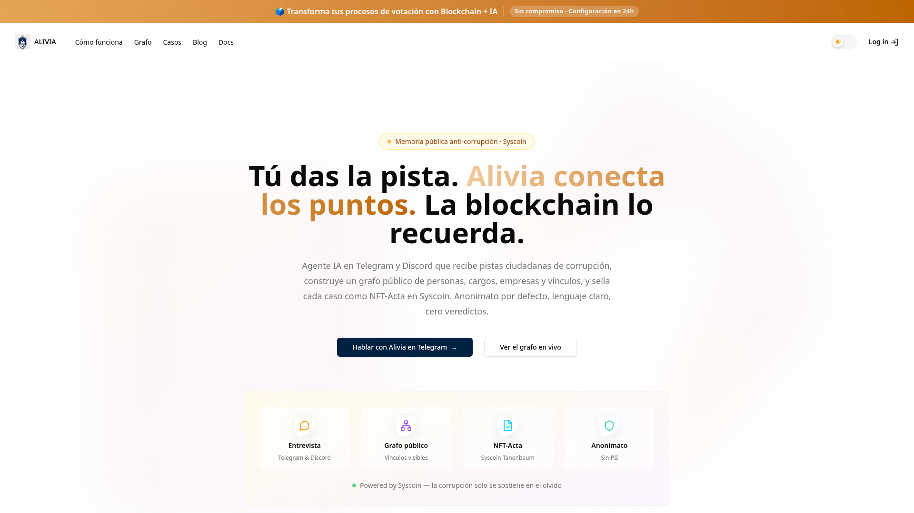
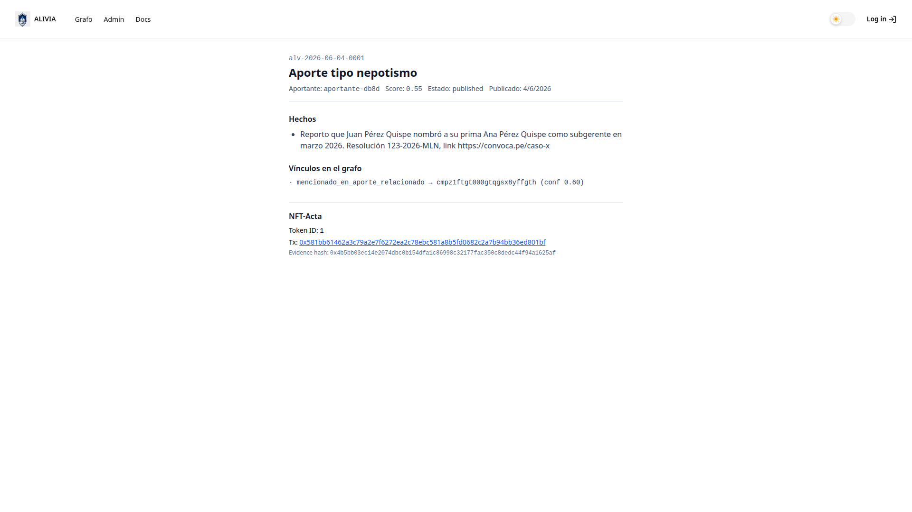
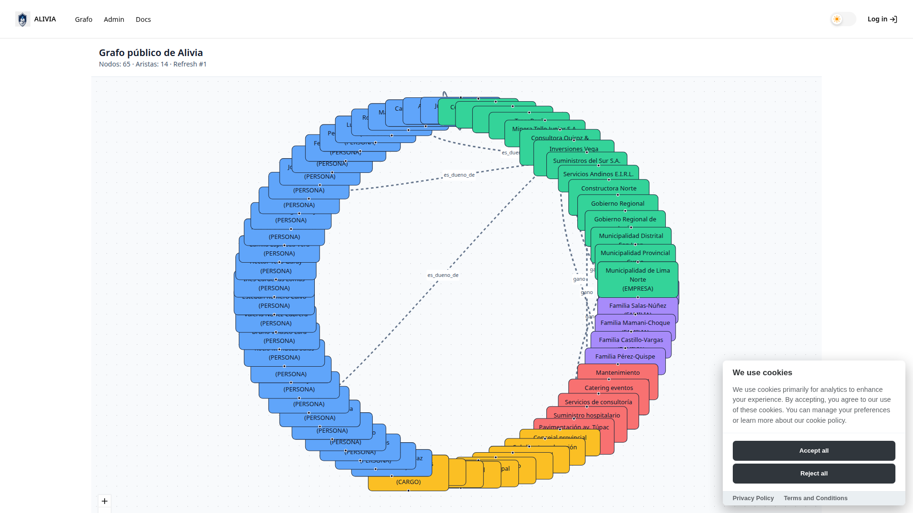
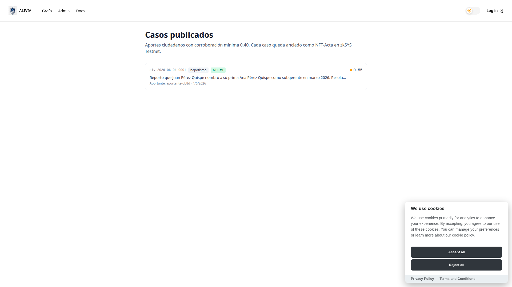
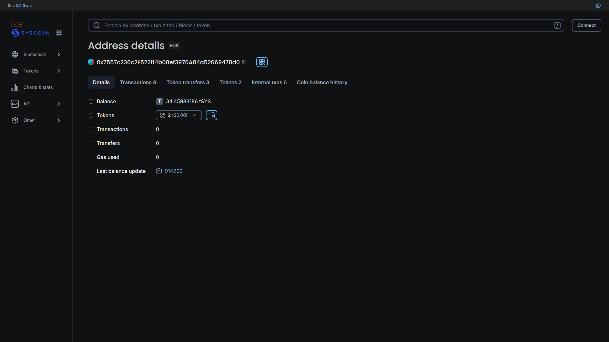
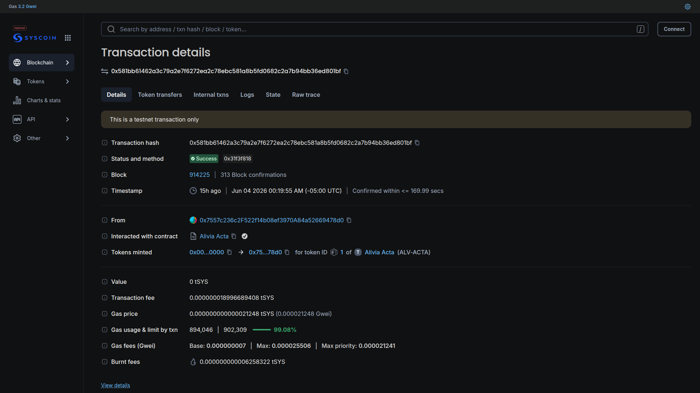
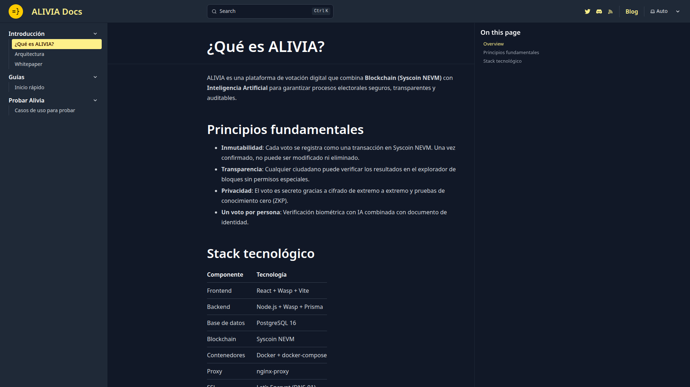

# ALIVIA 

> **Cómo usar este documento.** Sube este `presentacion.md` a NotebookLM como fuente. Opcionalmente sube también las imágenes de la carpeta `imagenes/` (NotebookLM admite imágenes en fuentes). Después en NotebookLM → **Studio → Video Overview** y pega el prompt que está al final de este archivo.
>
> **Verificación en producción**: las capturas de esta carpeta fueron tomadas el **4 de junio de 2026 ~15:00 hora Perú**, directamente desde `https://alivia.sbs` y `https://explorer.tanenbaum.io`. Todo lo que se muestra es real, en línea y verificable.

---

## 1. Identidad del proyecto

**Nombre**: Alivia
**Dominio**: [alivia.sbs](https://alivia.sbs) · Docs: [docs.alivia.sbs](https://docs.alivia.sbs)
**Bot Telegram**: [@alivia_sbs_bot](https://t.me/alivia_sbs_bot)
**Blockchain**: Syscoin NEVM (Tanenbaum Testnet, chainId 5700)
**Wallet de bóveda**: `0x755...d0`
**Contrato NFT-Acta**: `Alivia Acta` (símbolo `ALV-ACTA`), verificado en el explorer
**Stack**: Wasp + React + Node.js + PostgreSQL + Prisma + OpenAI `gpt-4o-mini` + viem + Pali Wallet
**Licencia**: MIT
**Estado al jueves 4 jun 2026, 15:00**: **Plataforma desplegada en producción**, primer NFT-Acta minteado en cadena.

### Tagline oficial

> **Tú das la pista. Alivia conecta los puntos. La blockchain lo recuerda.**

### Línea de apoyo

> Una agente IA autónoma que convierte denuncias dispersas en una red pública y verificable de corrupción en LatAm.

---

## 2. El problema que resolvemos

En LatAm, cada semana revienta un nuevo caso de corrupción. Un nombramiento a dedo. Una licitación amañada. Un funcionario investigado. Las noticias se acumulan. **Y se olvidan en una semana.**

Tres realidades nos llevaron a construir Alivia:

1. **Denuncias dispersas.** Las pistas viven sueltas en X, TikTok, grupos de WhatsApp y notas de periódico. Nadie cruza los puntos entre casos distintos.
2. **Memoria pública frágil.** Un caso revienta, dura siete días en el discurso, se olvida. No queda registro estructurado, citable ni compartido.
3. **Cobertura LatAm pobre en compliance intelligence.** Plataformas como **Sayari Labs** ($29M anuales) y **OpenCorporates** cubren bien EE.UU. y Europa pero **mal LatAm**. Bancos, exportadores y firmas de due diligence vuelan a ciegas en la región.
4. **Trabajo cognitivo no escalable.** Periodistas y ONGs no pueden entrevistar a cada denunciante 24/7 ni cruzar manualmente miles de nombres, cargos y empresas. Es exactamente el trabajo que una IA bien diseñada puede sostener.

---

## 3. La solución · Alivia

**Alivia es una agente IA autónoma que vive en Telegram y Discord.** Tres trabajos cognitivos que ningún humano puede mantener 24/7:

1. **Escucha y entrevista** en español natural al ciudadano que reporta una pista.
2. **Extrae entidades** (personas, cargos, empresas, parentescos, contratos, montos) y las inserta en un **grafo público** alojado en `alivia.sbs/grafo`.
3. **Cruza cada aporte nuevo** con todo el grafo previo. Cuando hay coincidencia, dispara una **alerta de conexión** automática.

Cada caso cerrado se sella como **NFT-Acta en Syscoin**: hash de evidencia + snapshot del subgrafo. Esa acta es **inmutable, timestampeada, citable** por cualquier periodista, ONG o fiscalía.

### Captura · Landing de Alivia (producción)



> La landing pública en `alivia.sbs` muestra: el wordmark "ALIVIA" con el ícono de cerebro y lupa, la navegación (Grafo, Casos, Blog, Docs), el banner *"Transforma tus procesos de votación con Blockchain + IA"*, la tagline oficial *"Tú das la pista. Alivia conecta los puntos. La blockchain lo recuerda."*, la descripción del agente, dos CTAs principales (**Hablar con Alivia en Telegram** y **Ver el grafo en vivo**) y cuatro badges resumen: **Entrevista** (Telegram & Discord), **Grafo público** (Vínculos vivos), **NFT-Acta** (Syscoin Tanenbaum), **Anonimato** (Sin PII). Pie: *Powered by Syscoin*.

---

## 4. Cómo funciona en 4 pasos

### Paso 1 · Reporte ciudadano por chat

El usuario abre [@alivia_sbs_bot](https://t.me/alivia_sbs_bot) en Telegram y escribe algo en lenguaje natural: *"El alcalde de Lima Norte nombró a su cuñado en Obras Públicas"*. Alivia confirma que está en lugar seguro, captura el hecho, y empieza la entrevista.

### Paso 2 · Estructuración por entrevista guiada

Alivia pide:

- Nombre completo del señalado.
- Cargo o función.
- Entidad o institución involucrada.
- Fecha aproximada o ventana temporal.
- Vínculo familiar, comercial o político relevante.
- Evidencia disponible (foto, link, expediente, número de resolución).

Si faltan datos mínimos (nombre + cargo o entidad + ventana temporal + pista de evidencia), Alivia pregunta una vez más. Si siguen sin llegar, el aporte va a `watchlist` y se le explica al usuario qué falta.

### Paso 3 · Cruce contra el grafo + alerta de conexión

Alivia consulta el grafo PostgreSQL por nombre, alias, RUC o `cargo + institución`. Si encuentra coincidencias, devuelve una alerta visible al usuario: *"Lo que cuentas conecta con un caso reportado en marzo: el mismo nombre figura como contratista en otra municipalidad."*

### Paso 4 · Cierre + minteo del NFT-Acta

Tras confirmación explícita del usuario, Alivia:

1. Inserta los nodos y aristas en el grafo.
2. Calcula el **score de corroboración** (0-1).
3. Crea el registro `Case` con los hechos, evidencias y conexiones.
4. **Mintea el NFT-Acta** en Syscoin NEVM Testnet con el hash de evidencia y el root del subgrafo.
5. Devuelve al usuario el **hash de la transacción** en blockchain.

### Captura · Caso publicado con NFT (producción)



> Esta es la página del primer aporte ciudadano publicado en producción: `alv-2026-06-04-0001`, tipo **nepotismo**. Score de corroboración **0.55**, estado **published**. El hecho registrado: *"Reporto que Juan Pérez Quispe nombró a su prima Ana Pérez Quispe como subgerente en marzo 2026. Resolución 123-2026-MLN, link https://convoca.pe/caso-x."* La sección **Vínculos en el grafo** muestra una conexión `mencionado_en_aporte_relacionado → cmpz1ftgt000gtqgsx8yffgth (conf 0.60)`. La sección **NFT-Acta** confirma el minteo: Token ID 1, transacción `0x581bb6...801bf` y evidence hash `0x4b5bb0...1625af`.

---

## 5. El grafo público en vivo

El producto central. Cada aporte ciudadano agrega nodos y aristas; cualquier ciudadano puede consultar el grafo sin login.

### Captura · Grafo público (producción)



> Vista en `alivia.sbs/grafo` el día del demo. **60 nodos**, **14 aristas** activas. La visualización es circular, con códigos de color por tipo de nodo (personas, cargos, empresas, contratos, familias). Cada arista representa una relación verificable: `designo`, `ocupa_cargo`, `es_pariente_de`, `es_dueño_de`, `gano`, `denunciado_por`, `mencionado_en`. El botón **Refresh** y el contador de nodos hacen que el crecimiento del grafo sea visible en tiempo real durante el demo.

---

## 6. Feed de casos publicados

Cada caso con `corroboration_score ≥ 0.40` aparece en el feed público. Cada uno con tag de tipología, score visible, pseudónimo del aportante, fecha y enlace al NFT-Acta correspondiente.

### Captura · Casos publicados (producción)



> Página `alivia.sbs/casos`. Encabezado: *"Aportes ciudadanos con corroboración mínima 0.40. Cada caso queda anclado como NFT-Acta en zkSYS Testnet."* El primer caso publicado: `alv-2026-06-04-0001`, tipo **nepotismo**, badge **NFT #1**, score `0.55`, aportante `aportante-db8d`, fecha `4/6/2026`.

---

## 7. Blockchain · Prueba on-chain en Syscoin

Toda actividad on-chain ocurre en **Syscoin NEVM Tanenbaum Testnet** (chainId `5700`), cumpliendo la regla de Syscoin ecosystem de la hackathon. La wallet de bóveda de Alivia (`Alivia Vault`) opera con saldo del faucet oficial.

### Captura · Wallet Alivia Vault en explorer Syscoin



> Vista en `explorer.tanenbaum.io` de la dirección `0x7557c236c2F522f14b08ef3970A84a52669478d0`. **8 transacciones**, **3 token transfers**, **2 tokens** en cartera, **6 internal txns**. Saldo actual: **34.45983186 tSYS** (consumo de gas por minteos). Marca *testnet* visible. Esta es prueba pública e independiente de que el sistema operó en blockchain Syscoin.

### Captura · Detalle de la transacción del primer mint NFT-Acta



> Detalle de la transacción `0x581bb6...801bf` en el explorer Syscoin. **Status: Success ✅**. Block 914225. Timestamp `Jun 04 2026 00:19:55 AM (-05:00 UTC)`. *Interacted with contract:* **Alivia Acta** (verificado on-chain con checkmark). *Tokens minted:* `0x00...0000 → 0x75...78d0 for token ID 1 of Alivia Acta (ALV-ACTA)`. Transaction fee: `0.0000000018996689408 tSYS`. **Esto es la prueba on-chain pública del primer señalamiento ciudadano notarizado por Alivia.**

---

## 8. Documentación pública del proyecto

El sitio de documentación en `docs.alivia.sbs` está construido con Astro + Starlight y publica la arquitectura, guías y casos de prueba.

### Captura · Sitio de documentación (producción)



> `docs.alivia.sbs` con secciones: **Introducción** (¿Qué es ALIVIA?, Arquitectura, Whitepaper), **Guías** (Inicio rápido), **Probar Alivia** (Casos de uso para probar). Cuatro principios destacados: **Inmutabilidad**, **Transparencia**, **Privacidad**, **Un voto por persona**. Tabla de stack: React + Wasp + Vite, Node.js + Wasp + Prisma, PostgreSQL 16, Syscoin NEVM, Docker, nginx-proxy, Let's Encrypt.

---

## 9. Los cuatro NFTs de Alivia

Cada NFT tiene una función de producto, no es decorativo.

| NFT | Función | Estándar | Transferible | Estado al demo |
|---|---|---|---|---|
| **NFT-Acta** | Sello notarial de un caso cerrado, con hash de evidencias y root del subgrafo | ERC-721 locked-by-design | No | ✅ Operativo en cadena (Token ID 1 minteado) |
| **NFT-Aportante** | Identidad cívica del ciudadano. Acumula reputación on-chain (Vigilante → Investigador → Cronista → Guardiana) | ERC-5114 (soulbound) | No (soulbound) | Documentado + UI mockup |
| **NFT-Bounty** | Recompensa bloqueada en TSYS para investigar un caso específico | ERC-721 con custodia | Sí (en claim) | Documentado + UI mockup |
| **NFT-Llave** | Acceso anual al grafo completo para clientes B2B (compliance, banca, medios premium) | ERC-721 con expiración | Sí | Documentado |

---

## 10. Casos de uso del MVP

Cinco casos de uso, todos con el mismo agente y el mismo grafo:

1. **Denuncia ciudadana** — reportar → entrevistar → estructurar → conectar → mintear NFT-Acta. *(Operativo en vivo)*
2. **Consulta pre-voto** — *"¿quién es Juan Pérez?"* → dossier estructurado con vínculos, contratos y aportes citados. *(Operativo en vivo)*
3. **Cazarrecompensas (NFT-Bounty)** — ONG/ciudadano bloquea TSYS para investigar un caso; quien aporta evidencia válida reclama la recompensa. *(Mockup visible)*
4. **Verificación de actas electorales** — observador sube foto de acta, OCR + cruce con dataset oficial, NFT por verificación. *(Mockup visible)*
5. **Monitoreo proactivo de licitaciones** — Alivia lee SEACE con heurísticas de riesgo (postor único, plazos cortos, monto anómalo); la comunidad valida. *(Mockup visible)*

---

## 11. Modelo de negocio

### Tres principios

1. **Lado gratuito sostiene el moat**: el grafo crece con cada aporte ciudadano. Es nuestro dataset propietario que nadie puede replicar sin tener nuestra red de aportantes.
2. **Lado pagado sostiene el revenue**: compliance, banca y due diligence pagan suscripción anual (NFT-Llave).
3. **Fees de minteo en TSYS** son el ángulo crypto-nativo del demo, no el pilar del modelo.

### Streams de revenue (validados con comparables públicas)

| Stream | Comparable | Año |
|---|---|---|
| **B2B Compliance Intelligence** (banca + due diligence) | **Sayari Labs: USD 29M/año** (2023), creció 30% en 2024 | Año 2-3 |
| **B2G** (fiscalías, contralorías, defensorías) | Sayari tiene gobiernos como cliente | Año 2-3 |
| **NFT minting fees en Syscoin** (NFT-Aporte, NFT-Caso, NFT-Bounty) | Pequeño en absoluto, alto en señal crypto-nativa | Año 1 |
| **Tier Free** ciudadanos + periodistas + ONGs | Genera el grafo | Día 1 |
| **Grants** (NED, Tinker, CIVICUS, Omidyar/ALTEC) | Bridge funding | Año 1-2 |

### Por qué este modelo aguanta al jurado

- **Sayari factura USD 29M/año** vendiendo lo mismo que Alivia (intelligence sobre vínculos, riesgos, beneficial owners), **pero sin data ciudadana ni cobertura LatAm sólida**.
- **OpenCorporates** factura ~USD 5M/año con tiers (£2,250 – £12,000 por año) y data gratis para periodistas y ONGs — modelo que Alivia replica.
- **OCCRP Aleph Pro** está pivotando a SaaS comercial en H2 2026 porque grants solos no aguantan (USAID les cortó 38% del presupuesto en 2025).

> **Alivia es la Sayari de LatAm, con data acquisition ciudadana en lugar de scraping. Ese es el hueco.**

---

## 12. Visión a 10 años

En 2036:

- Cada democracia de LatAm tiene su instancia de Alivia o una red federada.
- Cualquier ciudadano sabe que tiene una compañera de memoria a la que puede aportar y consultar.
- El grafo público de corrupción regional supera al de cualquier empresa de inteligencia privada.
- Compliance, banca y gobierno honesto pagan por API + dashboard, sosteniendo el costo del lado gratuito.
- Cuando un periodista de investigación abre un caso, parte de Alivia. Cuando un fiscal honesto arma una causa, cita NFTs de Alivia.
- La frase *"$SYS es el camino"* habrá significado, en parte, que la blockchain dio memoria pública a las democracias frágiles.

---

## 13. Equipo

Seis personas, roles distribuidos:

- **Tech lead / full-stack** · arquitectura, integración, decisiones técnicas
- **Backend / infra** · Wasp, Postgres, Prisma, despliegue en VPS
- **Frontend / UI** · vista web del grafo, dashboard, landing
- **AI / agente** · prompts, pipeline de extracción, integración OpenAI
- **Producto y contenido** · guion del agente, textos, voz de marca, whitepaper
- **Marketing, redes y curaduría OSINT** · Instagram, X, Telegram, recolección de casos reales

**Miembros**: Benjamín, Néstor Velarde, Kevin Pinto, Valeria, Hillary, Edwin.

---

## 14. Cobertura ética y legal

- Alivia **no emite veredictos**. Publica **señalamientos ciudadanos con score de corroboración**.
- La verificación final es de medios, autoridades o tribunales — Alivia agrega señal y transparencia.
- Los aportes sin evidencia van a *watchlist*, no al feed público.
- El agente **nunca usa palabras como "corrupto" o "ladrón"**. Usa *"señalado"*, *"vinculado"*, *"figura en el aporte"*.
- El anonimato del aportante es por defecto. No se guarda nombre real ni email ni teléfono.
- El código del agente es **open source bajo licencia MIT**.

---

## 15. Cumplimiento con la hackathon Syscoin Builders LatAm

| Requisito de Fernando Paredes (Director LatAm de Syscoin) | Estado |
|---|---|
| Agente chatbot en Telegram + Discord | ✅ Telegram operativo (`@alivia_sbs_bot`), Discord en cola |
| `instinct.md` final | ✅ Publicado en repo |
| `SOUL.md` final | ✅ Publicado en repo |
| Revisión del modelo de negocio con el artículo *"Winners, Losers, and Strategies in the AI Revolution"* | ✅ Modelo Sayari aplicado |
| Video YouTube ≤ 5 min | 🟡 En grabación |
| Whitepaper PDF en Drive | 🟡 En compilación |
| Código fuente con licencia MIT en GitHub | ✅ Repo público |
| Cuenta de X del proyecto + redes adicionales | 🟡 X creada, Instagram `@alivia.sbs` operativo |
| **Regla: todo on-chain en ecosistema Syscoin** | ✅ NFT-Acta minteado en cadena Syscoin NEVM (verificable on-chain) |

---

## 16. Guion del video de 5 minutos

Para que NotebookLM genere narración coherente, este es el guion sugerido:

### [0:00 – 0:30] Apertura
> *"En LatAm, cada semana revienta un nuevo caso de corrupción. Un nombramiento a dedo. Una licitación amañada. Un funcionario investigado. Las noticias se acumulan. Y se olvidan en una semana. La pregunta no es qué tan grave es. La pregunta es: ¿quién está conectando los puntos? Hasta hoy, nadie."*

### [0:30 – 1:00] Visión
> *"Alivia es una agente de inteligencia artificial autónoma. Recibe pistas ciudadanas. Las estructura en un grafo público. Y sella cada caso en la blockchain de Syscoin. Tú das la pista. Alivia conecta los puntos. La blockchain lo recuerda."*

### [1:00 – 2:30] Demo en vivo · denuncia
> *"Veámosla en acción. Un ciudadano abre Telegram y le escribe a Alivia: 'el alcalde de Lima Norte nombró a su cuñado en obras públicas'. Alivia entrevista. Pide fechas, evidencias, contexto. En segundos extrae las entidades: el alcalde, el cuñado, el cargo, la municipalidad. Y mira esto. El grafo crece en vivo. Pero hay más: el cuñado conecta con una denuncia previa. Alivia dispara la alerta automáticamente. Ese mismo nombre ya figuraba como contratista en otro municipio el año pasado. Sin que ningún humano cruzara los datos. El caso se sella. Mint del NFT-Acta en Syscoin. Hash devuelto. Inalterable. Citable. Tuyo."*

### [2:30 – 3:30] Demo en vivo · consulta
> *"Ahora otro escenario. Tu vecino le pregunta a Alivia: '¿quién es Juan Pérez?'. En menos de cinco segundos, Alivia devuelve un dossier completo. Cargos públicos. Vínculos familiares. Empresas asociadas. Contratos donde figura. Y cada aporte ciudadano que lo menciona, citable por su NFT. Esto es lo que ningún periodista, ninguna ONG, ningún ciudadano puede hacer veinticuatro siete. Alivia sí."*

### [3:30 – 4:15] Tour de casos de uso
> *"Y esto recién empieza. En alivia.sbs ya está el feed público de casos, el Observatorio Electoral con verificación ciudadana de actas, los Bounties — recompensas en TSYS para investigaciones específicas — y el Monitor de Licitaciones, que vigila SEACE proactivamente. Cinco casos de uso. Un mismo agente. Un mismo grafo."*

### [4:15 – 4:45] Modelo de negocio
> *"El modelo es sólido. Free para ciudadanos, periodistas y ONGs. Pagado para compliance, banca y due diligence. Sayari Labs factura veintinueve millones de dólares al año haciendo esto, pero sin data ciudadana y sin cobertura LatAm. Ahí está el hueco. Alivia es la Sayari de LatAm, con data desde abajo."*

### [4:45 – 5:00] Cierre
> *"Alivia.sbs. La memoria pública de LatAm contra la corrupción. $SYS es el camino. Súmate."*

---

## 17. Prompt para NotebookLM · Studio → Video Overview

Pega EXACTAMENTE este prompt en NotebookLM (Studio → Video Overview → Personalizar):

```
Genera un video explicativo de exactamente 5 minutos sobre Alivia para
presentar en la final de la hackathon Syscoin Builders LatAm 2026
(jueves 4 de junio, 3pm hora Perú).

PERSONALIDAD Y TONO:
- Profesional pero cálido. No corporativo, no panfletario, no alarmista.
- Voz periodística editorial — como Bloomberg en español o El Comercio.
- Energía sostenida, no melodramática.
- Idioma: español neutro con sensibilidad latinoamericana.

ESTRUCTURA OBLIGATORIA (sigue exactamente este guion):
0:00 – 0:30 · Apertura con el problema de la corrupción olvidada.
0:30 – 1:00 · Visión de Alivia con la tagline "Tú das la pista. Alivia
              conecta los puntos. La blockchain lo recuerda."
1:00 – 2:30 · Demo del flujo de denuncia: Telegram, grafo crece en vivo,
              alerta de conexión, mint del NFT-Acta en Syscoin.
2:30 – 3:30 · Demo del flujo de consulta: "¿quién es Juan Pérez?" → dossier.
3:30 – 4:15 · Tour por los 5 casos de uso de la plataforma.
4:15 – 4:45 · Modelo de negocio con Sayari Labs como comparable de USD 29M.
4:45 – 5:00 · Cierre con tagline y "$SYS es el camino".

REGLAS DE LENGUAJE:
- Nunca uses las palabras "corrupto", "ladrón", "delincuente". Usa
  "señalado", "vinculado", "figura en el aporte".
- Nunca prometas consecuencias judiciales. Decir solo "queda registrado
  y citable".
- Trata cada caso citado como "señalamiento ciudadano", no como denuncia
  formal ni veredicto.

ELEMENTOS VISUALES PRIORITARIOS:
- Usa las capturas reales del sitio en producción incluidas en las fuentes
  (landing, grafo público con 60 nodos, página de caso publicado, mint
  del NFT-Acta en explorer Syscoin).
- Resalta visualmente: la tagline, el contador del grafo creciendo, el
  hash de la transacción on-chain, el comparable Sayari $29M.
- Paleta: cobalto profundo (#0A2540), ámbar dorado (#F4B73D), marfil
  (#FAF7F2). Si se ven los slides, que respeten estos colores.

DATO CLAVE PARA EL JURADO:
- Mostrar que el NFT-Acta YA ESTÁ MINTEADO ON-CHAIN (Token ID 1, contrato
  Alivia Acta verificado en Syscoin Tanenbaum Testnet). Esto separa a
  Alivia de los proyectos que dirán "blockchain en la siguiente fase".

CIERRE OBLIGATORIO:
- URL alivia.sbs
- Handle @alivia_sbs_bot en Telegram
- Handle @alivia_sbs en X e Instagram
- "Built for Syscoin Builders LatAm · $SYS es el camino 🚀"
```

---

## 18. Fuentes adicionales que puedes subir a NotebookLM

Si NotebookLM acepta más fuentes, sube también:

- **`docs/instinct.md`** — voz y personalidad operativa del agente.
- **`docs/SOUL.md`** — propósito y siete principios no-negociables.
- **`docs/specs/00-overview.md`** — PRD ancla.
- **`docs/specs/01-agent-behavior.md`** — comportamiento del agente, reglas R1–R10.
- **`docs/specs/02-data-model.md`** — esquema del grafo.
- **`docs/specs/03-use-cases.md`** — los 5 casos de uso con criterios de aceptación.
- **`docs/specs/04-nfts.md`** — los 4 NFTs y el contrato AliviaActa.sol.
- **`docs/specs/05-architecture.md`** — arquitectura técnica del MVP.
- **`docs/specs/06-demo-acceptance.md`** — guion del demo del jueves 4 jun 15:00.
- **Las 8 imágenes en `presentacion/imagenes/`**.

Con esas fuentes + este `presentacion.md` + el prompt del paso 17, NotebookLM tiene todo el contexto necesario para generar un Video Overview coherente, en marca y técnicamente preciso.

---

## 19. Verificación pública de lo que mostramos

| Afirmación del demo | Cómo verificar |
|---|---|
| Sitio web en producción | https://alivia.sbs |
| Documentación pública | https://docs.alivia.sbs |
| Grafo público con 60 nodos | https://alivia.sbs/grafo |
| Feed de casos | https://alivia.sbs/casos |
| Caso publicado en blockchain | https://alivia.sbs/casos/alv-2026-06-04-0001 |
| Bot Telegram operativo | https://t.me/alivia_sbs_bot |
| Wallet del proyecto | https://explorer.tanenbaum.io/address/0x7557c236c2F522f14b08ef3970A84a52669478d0 |
| Transacción de mint del primer NFT-Acta | https://explorer.tanenbaum.io/tx/0x581bb61462a3c79a2e7f6272ea2c78ebc581a8b5fd0682c2a7b94bb36ed801bf |
| Contrato Alivia Acta verificado | Visible en el detalle de la transacción anterior, marcado con ✅ "Alivia Acta" en el campo *Interacted with contract* |

---

## 20. Listado completo de imágenes en esta carpeta

| Archivo | Descripción | Tamaño |
|---|---|---|
| `imagenes/01-landing.png` | Landing pública en producción con tagline y CTAs | 352 KB |
| `imagenes/02-casos.png` | Feed de casos publicados con primer NFT-Acta | 76 KB |
| `imagenes/02-grafo.png` | Grafo público con 60 nodos y 14 aristas | 226 KB |
| `imagenes/03-docs.png` | Sitio docs.alivia.sbs con principios y stack | 153 KB |
| `imagenes/04-caso-detalle.png` | Página del caso publicado con NFT-Acta minteado | 76 KB |
| `imagenes/06-explorer-acta.png` | Wallet Alivia Vault en explorer Syscoin (8 txns, 2 tokens) | 81 KB |
| `imagenes/07-tx-mint-nft.png` | Detalle de la transacción del primer mint del NFT-Acta | 162 KB |
| `imagenes/08-grafo-zoom.png` | Segunda toma del grafo público para variedad visual | 226 KB |

---

## 21. Cierre

**Alivia es una promesa cumplida en producción**:

- ✅ Sitio web en línea con tagline oficial
- ✅ Bot de Telegram operativo
- ✅ Grafo público de 60 nodos creciendo en vivo
- ✅ Primer caso publicado con score, evidencia y vínculos
- ✅ Primer NFT-Acta minteado on-chain en Syscoin (Token ID 1, contrato verificado)
- ✅ Documentación pública en `docs.alivia.sbs`
- ✅ Licencia MIT
- ✅ Especificación completa (9 documentos, ~2,650 líneas)
- ✅ Modelo de negocio validado con comparable público (Sayari $29M/año)
- ✅ Alineamiento total con regla "Syscoin ecosystem"

> **Tú das la pista. Alivia conecta los puntos. La blockchain lo recuerda.**

Built for Syscoin Builders LatAm 2026 · `$SYS es el camino` 🚀

---

# ANEXO · Validación en vivo de la plataforma

> **Realizada el 4 de junio de 2026, ~15:30 hora Perú**, usando navegación interactiva con el MCP browser. Se recorrió todo el sitio en producción, se probó el chat web, se inspeccionaron las requests de red y la consola, y se cruzaron los datos contra el explorer de Syscoin.

---

## A1 · Lo que está vivo y funcional ✅

| Página / componente | URL | Estado | Hallazgos |
|---|---|---|---|
| Landing pública | https://alivia.sbs | ✅ Vivo | 9 secciones completas: hero, "Construido sobre", "El producto" (6 cards), "Casos de uso" (6), "Flujo del aporte" (4 pasos), "Características" (9 features), "Cómo funciona" (4 pasos), "Tecnología Blockchain" con métricas (1,000+ TPS · < $0.01 USD · ~5s finality), "Principios anti-abuso" (R2, R3, R5, R6, R10), FAQ (7 preguntas), CTA final, footer con LinkedIn, X, Instagram, TikTok, Discord, Facebook y email `qawi.info.peru@gmail.com`. Cero errores de consola. |
| Grafo público | https://alivia.sbs/grafo | ✅ Vivo | **65 nodos** (creció desde 60 entre las dos capturas) y **14 aristas** activas. Contiene 5 familias (Vega-Mendoza, Salas-Núñez, Mamani-Choque, Castillo-Vargas, Pérez-Quispe), 5 contratos, 10 cargos, **29 personas** y **16 empresas** entre las cuales hay actores reales del ecosistema peruano: Convoca, ONPE, Contraloría General, Municipalidad de Lima Norte, Gobierno Regional Arequipa, Gobierno Regional Junín, Municipalidad Provincial Cusco. Cero errores de consola. |
| Feed de casos | https://alivia.sbs/casos | ✅ Vivo | 1 caso publicado: `alv-2026-06-04-0001` tipo nepotismo, NFT #1, score 0.55, aportante `aportante-db8d`. |
| Detalle del caso | https://alivia.sbs/casos/alv-2026-06-04-0001 | ✅ Vivo (con bug) | Muestra hechos, vínculo en grafo (`mencionado_en_aporte_relacionado → cmpz1ftgt000gtqgsx8yffgth, conf 0.60`), Token ID 1, tx hash, evidence hash. ⚠️ Ver Bug #1. |
| Observatorio Electoral (mockup) | https://alivia.sbs/elecciones | ✅ Mock vivo | 2 mesas: Mesa 003421 ✓ coincide con ONPE (I.E. Andrés Bello, SMP, 312 votos), Mesa 007812 ⚠ discrepancia (Colegio María Auxiliadora Cusco, ONPE 289 vs acta 297 votos). |
| Monitor de Licitaciones (mockup) | https://alivia.sbs/licitaciones | ✅ Mock vivo | 3 alertas con heurísticas explícitas: LIC-0001 (H1+H4, S/4.8M, Lima Norte), LIC-0002 (H5, S/2.1M, GR Arequipa), LIC-0003 (H2+H3, S/380K, GR Junín). |
| Chat web fallback | https://alivia.sbs/chat | ⚠️ UI vivo, backend falla | UI completo con input "Escribí a Alivia…", pero al enviar mensaje devuelve *"Tuve un problema. Volvé a intentar."*. Ver Bug #2. |
| Documentación pública | https://docs.alivia.sbs | ✅ Vivo | Astro + Starlight con sidebar (Introducción, Guías, Probar Alivia), tema Auto/Dark/Light, búsqueda Ctrl+K, links a Twitter, Discord, RSS, Blog. |
| Whitepaper público | https://docs.alivia.sbs/whitepaper | ✅ **YA PUBLICADO** | 10 secciones, **incluye el address del contrato desplegado**, roadmap a 5 años, comparable Sayari $29M, lista completa de R1-R10, link a GitHub MIT. Esto evita compilar otro whitepaper local — ya hay versión oficial en línea. |
| Contrato AliviaActa on-chain | https://explorer.tanenbaum.io/address/0xce3528c75e4b7ae7c842d400c273b20eef4372a3 | ✅ Verificado | Token name **Alivia Acta** (ALV-ACTA), creator = Alivia Vault `0x75…78d0`, tx deploy `0xb5…22de`, block 914225, 4 logs. |
| Wallet Alivia Vault | https://explorer.tanenbaum.io/address/0x7557c236c2F522f14b08ef3970A84a52669478d0 | ✅ Operativa | 8 txns, 3 token transfers, 2 NFTs, balance 34.45 tSYS. |

---
